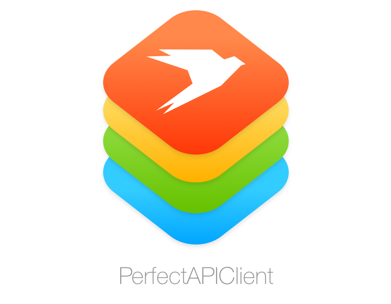
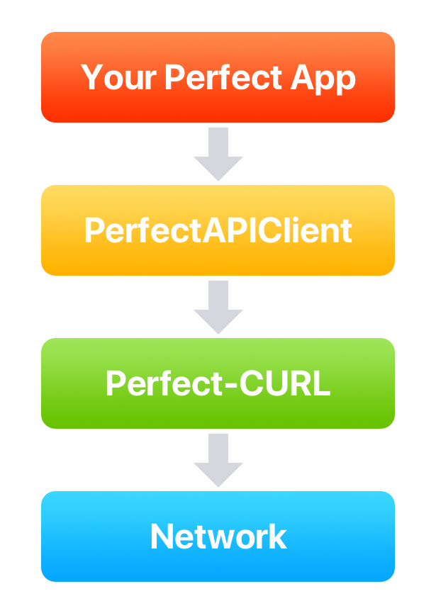

<p align="center"></p>

<p align="center">
	<a href="https://developer.apple.com/swift/" target="_blank">
		
	</a>
	
		<a href="https://github.com/SvenTiigi/PerfectAPIClient/blob/master/LICENSE" target="_blank">
		
	</a>
</p>

PerfectAPIClient is a network abstraction layer to perform network requests via [Perfect-CURL](https://github.com/PerfectlySoft/Perfect-CURL) from your [Perfect Server Side Swift](https://github.com/PerfectlySoft/Perfect) application. It's heavily inspired by [Moya](https://github.com/Moya/Moya) and easy and fun to use.

<p align="center"></p>

## Installation
To integrate using Apple's Swift package manager, add the following as a dependency to your `Package.swift`:

```swift
.package(url: "https://github.com/SvenTiigi/PerfectAPIClient.git", from: "1.0.0")
```
Here's an example `PackageDescription`:

```swift
// swift-tools-version:4.0
import PackageDescription

let package = Package(
    name: "MyPackage",
    products: [
        .library(
            name: "MyPackage",
            targets: ["MyPackage"]),
    ],
    dependencies: [
        .package(url: "https://github.com/SvenTiigi/PerfectAPIClient.git", from: "1.0.0")
    ],
    targets: [
        .target(
            name: "MyPackage",
            dependencies: ["PerfectAPIClient"])
    ]
)
```

## Setup
In order to define the network abstraction layer with PerfectAPIClient, an enumeration will be declared to access the API endpoints. In this example we declare a `GithubAPIClient` to retrieve some Github [zen](https://api.github.com/zen) and [user information](https://api.github.com/users/sventiigi). The full example can be found [here](https://github.com/SvenTiigi/PerfectAPIClient/blob/master/Tests/PerfectAPIClientTests/GithubAPI/GithubAPIClient.swift).

```swift
import PerfectHTTP
import PerfectCURL
import ObjectMapper

/// Github API Client in order to access Github API Endpoints
enum GithubAPIClient {
    /// Retrieve zen
    case zen
    /// Retrieve user info for given username
    case user(name: String)
}
```
Next up we implement the `APIClient` protocol to define the request information like base url, endpoint path, HTTP header, etc...

```swift
// MARK: APIClient

extension GithubAPIClient: APIClient {
    
    /// The base url
    var baseURL: String {
        return "https://api.github.com/"
    }
    
    /// The path for a specific endpoint
    var path: String {
        switch self {
        case .zen:
            return "zen"
        case .user(name: let name):
            return "users/\(name)"
        }
    }
    
    /// The http method
    var method: HTTPMethod {
        switch self {
        case .zen:
            return .get
        case .user:
            return .get
        }
    }
    
    /// The authentication HTTP headers
    var authenticationHeaders: [String : String]? {
        return nil
    }
    
    /// The HTTP headers for a specific endpoint
    var headers: [String : String]? {
        return ["User-Agent": "PerfectAPIClient"]
    }
    
    /// The request payload for a POST or PUT request
    var requestPayload: BaseMappable? {
        return nil
    }
    
    /// Advanced CURLRequest options like SSL or Proxy settings
    var options: [CURLRequest.Option]? {
        return nil
    }
    
}
```
There is also an [JSONPlaceholderAPIClient](https://github.com/SvenTiigi/PerfectAPIClient/blob/master/Tests/PerfectAPIClientTests/JSONPlaceholderAPI/JSONPlaceholderAPI.swift) example available.

## Usage
PerfectAPIClient enables an easy way to access an API like this:

```swift
GithubAPIClient.zen.request { (result: APIClientResult<CURLResponse>) in
    result.analysis(success: { (response: CURLResponse) in
        // Do awesome stuff with the response
        print(response.bodyString) // Some zen
    }, failure: { (error: Error) in
        // Oh boy you are in trouble
    }
}
```

Or even retrieve an `JSON` response as an automatically mapped object.

```swift
GithubAPIClient.user(name: "sventiigi").request(mappedResponseType: User.self) { (result: APIClientResult<User>) in
    result.analysis(success: { (user: User) in
        // Do awesome stuff with the user
        print(user.name) // Sven Tiigi
    }, failure: { (error: Error) in
        // Oh boy you are in trouble again
    }
}
```

The user object implements the `Mappable` protocol based on the [ObjectMapper](https://github.com/Hearst-DD/ObjectMapper) library to perform the mapping between your classes/structs and `JSON`.

```swift
import ObjectMapper

struct User {
    /// The identifier
    var id: Int?
    /// The users full name
    var name: String?
    /// The user type
    var type: String?
}

// MARK: Mappable

extension User: Mappable {
    /// ObjectMapper initializer
    init?(map: Map) {}
    
    /// Mapping
    mutating func mapping(map: Map) {
        self.id     <- map["id"]
        self.name   <- map["name"]
        self.type   <- map["type"]
    }
}
```

## Advanced Usage

### Modify Response
By overriding the `modifyResponse` function you can update the response before it's being passed to the completion closure or JSON mapping will be performed. It's handy when the response JSON is wrapped inside a `result` property.

```swift
public func modifyResponse(payload: [String : Any]) -> [String : Any] {
    // Try to retrieve JSON inside result property
    guard let resultJSON = payload["result"] as? [String: Any] else {
        return payload
    }
    return resultJSON
}
```

### Will Perform Request
By overriding the `willPerformRequest` function you can perform logging operation or something else your might want to do, before the request of an `APIClient` will be executed.

```swift
func willPerformRequest(url: String, options: [CURLRequest.Option]) {
    print("Github API Client will perform request \(url) with options: \(options)")
}
```

### Did Retrieve Response
By overriding the `didRetrieveResponse` function you can perform logging operation or something else your might want to do, after the response of an request for an `APIClient` is being retrieved.

```swift
func didRetrieveResponse(url: String, options: [CURLRequest.Option], result: APIClientResult<CURLResponse>) {
    print("Github API Client did retrieve response for request \(url) with options: \(options) and result: \(result)")
}
```

## Linux Build Notes
Ensure that you have installed libcurl.

```
sudo apt-get install libcurl4-openssl-dev
```

## Dependencies
PerfectAPIClient is using the following dependencies:

* [Perfect-HTTP](https://github.com/PerfectlySoft/Perfect-HTTP)
* [Perfect-CURL](https://github.com/PerfectlySoft/Perfect-CURL)
* [ObjectMapper](https://github.com/Hearst-DD/ObjectMapper)

## License

```
MIT License

Copyright (c) 2017 Sven Tiigi

Permission is hereby granted, free of charge, to any person obtaining a copy
of this software and associated documentation files (the "Software"), to deal
in the Software without restriction, including without limitation the rights
to use, copy, modify, merge, publish, distribute, sublicense, and/or sell
copies of the Software, and to permit persons to whom the Software is
furnished to do so, subject to the following conditions:

The above copyright notice and this permission notice shall be included in all
copies or substantial portions of the Software.

THE SOFTWARE IS PROVIDED "AS IS", WITHOUT WARRANTY OF ANY KIND, EXPRESS OR
IMPLIED, INCLUDING BUT NOT LIMITED TO THE WARRANTIES OF MERCHANTABILITY,
FITNESS FOR A PARTICULAR PURPOSE AND NONINFRINGEMENT. IN NO EVENT SHALL THE
AUTHORS OR COPYRIGHT HOLDERS BE LIABLE FOR ANY CLAIM, DAMAGES OR OTHER
LIABILITY, WHETHER IN AN ACTION OF CONTRACT, TORT OR OTHERWISE, ARISING FROM,
OUT OF OR IN CONNECTION WITH THE SOFTWARE OR THE USE OR OTHER DEALINGS IN THE
SOFTWARE.
```